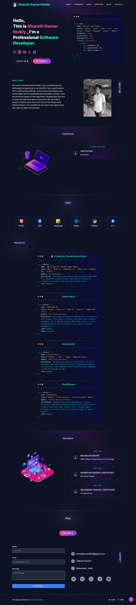

# 👨‍💻 Sharath Kumar Reddy's Developer Portfolio

Welcome to my portfolio! 🚀 I am Sharath Kumar Reddy, a passionate **Software Engineer** focused on **AI**, **Machine Learning**, and **Full-Stack Development**. Here, you’ll find my work, projects, and the technologies I use to create impactful solutions.

🌐 Check out my live portfolio:
- [Sharath Kumar Reddy Portfolio](https://sharathkumar.netlify.app/)
- [GitHub - Pro Portfolio](https://github.com/sharath-66b6/Portfolio.git)

---

## 📖 About Me

- 🧑‍💻 **Current Focus:** Building intelligent systems, working on **AI-powered applications** and **full-stack web development**.
- 📚 **Learning:** Continuously exploring new **technologies**, improving my skills in **Python**, **TensorFlow**, **PyTorch**, **React**, and more.
<!-- - 🎥 **YouTube Channel:** [Sharath Kumar Reddy](https://www.youtube.com/channel/UCzQwWwpTnVOu8zKfPTrQw2A) – 5.5K Subscribers, focusing on **AI**, **Software Engineering**, and **Tech Tutorials**. -->

---

## 🚀 Projects

Here are some of the exciting projects I’ve worked on:

### 1. **Jarvis AI Assistant**
- A **speech-to-text** powered **AI assistant** capable of performing tasks, answering questions, and much more.
- Technologies: **Python**, **TensorFlow**, **PyTorch**, **Speech Recognition**.

### 2. **AI Resume Generator**
- An **AI-powered resume generator** using machine learning to craft perfect resumes.
- Technologies: **Python**, **Natural Language Processing**, **React**.

### 3. **NetHyTech-OpenSource**
- A coding blog platform built using **Next.js**, showcasing open-source projects and tutorials.
- Technologies: **Next.js**, **JavaScript**, **CSS**.

---

## 💻 Technologies & Tools

| Technology          | 💼 Experience | 🔧 Usage                                    |
|---------------------|---------------|---------------------------------------------|
| **Python**          | ⭐⭐⭐⭐⭐         | Backend development, Machine Learning      |
| **JavaScript**      | ⭐⭐⭐⭐          | Frontend development, Node.js              |
| **React**           | ⭐⭐⭐⭐          | Building interactive UIs                   |
| **TensorFlow**      | ⭐⭐⭐⭐          | AI & ML models                              |
| **PyTorch**         | ⭐⭐⭐⭐          | Deep Learning                              |
| **SQL**             | ⭐⭐⭐⭐          | Database Management, Query Optimization    |
| **PySpark**         | ⭐⭐⭐⭐          | Big Data Processing                        |
| **HTML/CSS**        | ⭐⭐⭐⭐⭐         | Web Design, UI/UX                          |
| **Git**             | ⭐⭐⭐⭐⭐         | Version Control, Collaboration             |
| **Docker**          | ⭐⭐⭐⭐          | Containerization                           |
| **AWS**             | ⭐⭐⭐⭐          | Cloud Services                             |
| **MongoDB**         | ⭐⭐⭐⭐          | NoSQL Database                             |
| **VSCode**          | ⭐⭐⭐⭐⭐         | IDE for coding and development             |

---

## 🧑‍💻 Skills

- **Software Engineering**: Full-Stack Development, Agile Development, System Design
- **Artificial Intelligence & Machine Learning**: Model Development, Neural Networks, NLP, AI applications
- **Web Development**: React.js, Node.js, REST APIs, Responsive Design
- **Data Science**: Data Analysis, Data Visualization, Data Cleaning, Machine Learning Algorithms

---

## 🛠️ Tools & Software

- **VS Code** - My primary development environment 💻
- **GitHub** - For code collaboration and version control 🧑‍💻
- **Figma** - UI/UX Design for beautiful user interfaces 🎨
- **AWS** - For cloud deployment ☁️
- **Docker** - Containerization and environment management 🐳
- **Postman** - API testing and documentation 📡

---

## 💬 Let's Connect!

- 🐦 **Linkedin:** [@Sharath](https://www.linkedin.com/in/sharath-kumar-reddy-software-engineer)
- 🐦 **Twitter:** [@Sharath](https://x.com/Sharath56567820)

Feel free to reach out for collaborations, open-source contributions, or just to chat about tech! 🚀

---

## 📂 License

Distributed under the MIT License. See `LICENSE` for more information.

---

Thank you for visiting my portfolio! ✨

